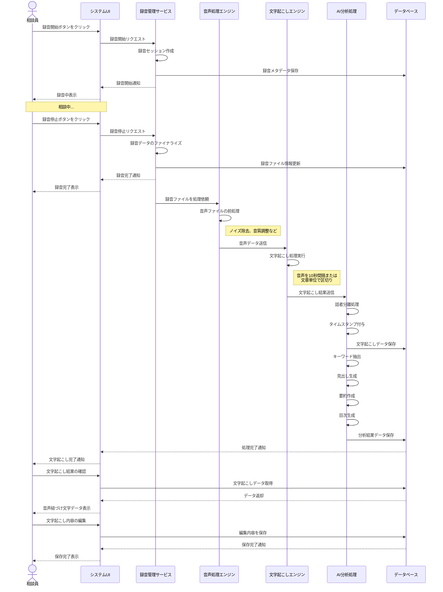

# 東広島基幹相談支援センターの記録管理システム

本システムは以下の通りのシステムで構成されます。

- モバイルデバイス
- PC端末
- 電話接続システム（クラウドPBX）
- 記録管理システムソフトウェア
  - 相談支援文書作成機能
  - 相談支援機能

## 相談支援文書作成機能

## 相談支援機能（AI支援機能）

### 音声録音機能

相談内容を録音する機能を実装します。これにより、相談内容を漏れなく保存し、後から参照することが可能になります。録音は相談記録と紐づけて管理され、必要に応じていつでも聞き返すことができます。

### 文字起こし機能

録音したデータを文字起こしし、テキストデータとして保存します。理想的にはリアルタイムでの文字起こしと障害相談支援に関わるキーワードの抽出が望ましいですが、現状の技術では精度に限界があります。そのため、録音後に高精度な文字起こし処理を行う方式を採用します。

文字起こしされたデータは、文章ごとや約10秒程度の会話で区切り、「時間，文章」という形式のデータ（音声紐づけ文字データ）として一覧表示します。これにより、長時間の録音内容でも容易に内容を把握することができます。

### しおり機能

文字起こしデータの特定箇所に「しおり」を付ける機能を実装します。重要なポイントや後で参照したい箇所などにしおりを設定することで、大量のデータの中から必要な情報をすぐに見つけることができるようになります。

### 音声-テキスト連携再生機能

録音データをプレイヤーと紐づけ、文字起こしされたテキストの任意の箇所をクリックすると、そのあたりのタイムラインから音声を再生できる機能を実装します。これにより、文字だけでは伝わりにくいニュアンスや話し方などの情報も含めて確認することができます。

### 見出し・要約・目次生成機能

文字起こしされたデータから自動で見出し、要約、目次を生成します。これにより、長文の相談内容でも全体像を把握しやすくなり、ユーザビリティが向上します。生成された見出しや要約は編集も可能で、必要に応じてカスタマイズすることができます。

### データアクセス・検索機能

ユーザーは、見出しと録音日時から録音データ・文字起こしデータを選択できます。また、生成された目次から音声紐づけ文字データの一覧を表示することができ、データアクセスが簡便になります。さらに、キーワード検索機能により、大量の相談記録の中から必要な情報をすばやく見つけることが可能になります。

## 録音データから文字起こしデータに変換されるまでのプロセス

