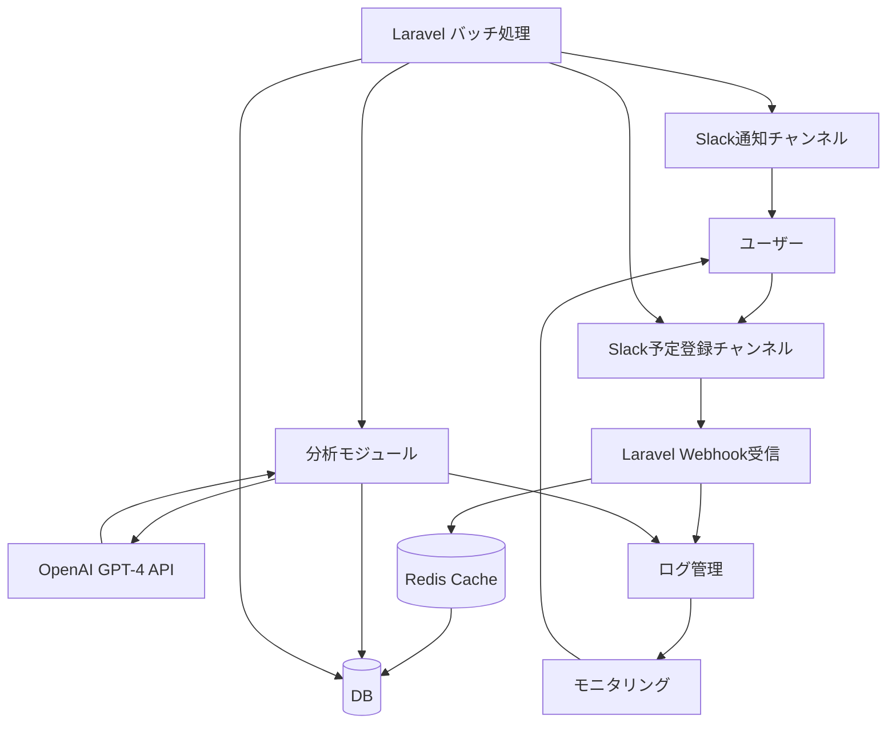

# Slack予定管理システム 仕様書

## システム概要

Slackチャンネルで投稿された予定に関するメッセージを自動的に解析し、予定として登録・管理するシステムです。
OpenAI GPT-4 APIを活用して自然言語から予定情報を抽出し、適切なタイミングでSlack通知を行います。
AIによる高精度な予定抽出と、柔軟な通知管理を実現します。

## システム構成図



## データベース設計

### slack_messages テーブル
Slackから受信した生のメッセージを保存するテーブル

| カラム名 | 型 | 説明 |
|----------|------|------------|
| id | BIGINT UNSIGNED | 主キー |
| channel_id | VARCHAR(255) | チャンネルID |
| user | VARCHAR(255) | 送信者のSlack ID |
| text | TEXT | メッセージ本文 |
| timestamp | TIMESTAMP | メッセージの受信時刻 |
| slack_ts | VARCHAR(255) | Slackのタイムスタンプ（ユニーク制約付き） |
| created_at | TIMESTAMP | レコード作成日時 |
| updated_at | TIMESTAMP | レコード更新日時 |

インデックス:
- PRIMARY KEY (`id`)
- UNIQUE INDEX `slack_messages_slack_ts_unique` (`slack_ts`)

### scheduled_events テーブル
解析された予定情報を保存するテーブル

| カラム名 | 型 | 説明 |
|----------|------|------------|
| id | BIGINT | 主キー |
| slack_message_id | BIGINT | slack_messagesテーブルの外部キー |
| event_type | VARCHAR(50) | 予定の種類（meeting: 会議、lunch: 会食、task: タスク、other: その他） |
| title | VARCHAR(255) | 予定のタイトル |
| description | TEXT | 予定の詳細説明 |
| start_datetime | DATETIME | 開始日時 |
| end_datetime | DATETIME | 終了日時 |
| location | VARCHAR(255) | 場所（オンライン会議のURLなど） |
| participants | JSON | 参加者情報（メールアドレスの配列） |
| status | VARCHAR(20) | ステータス（pending: 未実施、in_progress: 進行中、completed: 完了、cancelled: キャンセル） |
| priority | VARCHAR(20) | 優先度（high: 高、medium: 中、low: 低） |
| recurrence | JSON | 繰り返し設定（null: 単発、weekly: 毎週、monthly: 毎月など） |
| notification_settings | JSON | 通知設定（通知タイミング、通知チャンネル等） |
| created_at | TIMESTAMP | 作成日時 |
| updated_at | TIMESTAMP | 更新日時 |

### event_analyses テーブル
メッセージの分析結果を保存するテーブル

| カラム名             | 型                | 説明                                                        |
|----------------------|-------------------|-------------------------------------------------------------|
| id                   | BIGINT            | 主キー                                                      |
| slack_message_id     | BIGINT            | slack_messagesテーブルの外部キー                             |
| scheduled_event_id   | BIGINT            | scheduled_eventsテーブルの外部キー                           |
| analysis_type        | VARCHAR(50)       | 分析の種類（event_extraction: 予定抽出）                     |
| extracted_data       | JSON              | 抽出されたデータ（KeyValue形式で保存。例：{"event_type": "会議", "title": "定例MTG", ...}） |
| confidence_score     | FLOAT             | AIの信頼度スコア（0.0〜1.0）                                |
| analysis_status      | VARCHAR(20)       | 分析ステータス（success: 成功、failed: 失敗）                |
| created_at           | TIMESTAMP         | 作成日時                                                    |
| updated_at           | TIMESTAMP         | 更新日時                                                    |

#### 【event_analysesテーブルの役割・運用例】
- 各Slackメッセージ（slack_messagesテーブル）の内容（textカラムなど）をOpenAI APIで分析し、予定情報（例：イベントタイプ、タイトル、説明、開始日時、終了日時、場所、参加者、優先度など）を抽出します。
- 分析結果（extracted_dataカラム：JSON形式）や、分析の信頼度（confidence_score）、分析の成否（analysis_status）をevent_analysesテーブルに記録します。
- 分析が成功し、予定情報が抽出できた場合は、scheduled_eventsテーブルに予定情報を新規登録し、そのID（scheduled_event_id）をevent_analysesに紐付けます。
- 分析に失敗した場合や、抽出できなかった場合は、analysis_statusをfailedやpartialとし、extracted_dataにエラー内容や部分的なデータを格納します。

#### 【分析フロー例】
1. バッチ処理（slack:analyze-messagesコマンド）で、未分析または分析未完了のSlackメッセージを取得。
2. OpenAI APIでメッセージ内容を分析し、予定情報を抽出。
3. event_analysesテーブルに分析結果（extracted_data）・信頼度・ステータスを保存。
4. 予定情報が抽出できた場合は、scheduled_eventsテーブルに新規登録し、event_analysesのscheduled_event_idに紐付け。
5. 分析失敗時は、event_analysesにエラー内容を記録。

#### 【event_analysesテーブルのレコード例】
| id | slack_message_id | scheduled_event_id | analysis_type     | extracted_data                                                                 | confidence_score | analysis_status | created_at           | updated_at           |
|----|------------------|-------------------|-------------------|-------------------------------------------------------------------------------|------------------|-----------------|----------------------|----------------------|
| 1  | 1001             | 2001              | event_extraction  | {"event_type":"meeting","title":"定例MTG","description":"週次定例","start_datetime":"2024-06-01T10:00:00+09:00","end_datetime":"2024-06-01T11:00:00+09:00","location":"会議室A","participants":["user@example.com"],"priority":"medium"} | 0.92             | success         | 2024-06-01 09:00:00  | 2024-06-01 09:00:00  |
| 2  | 1002             | null              | event_extraction  | {"error":"日付情報が見つかりませんでした"}                                   | 0                | failed          | 2024-06-01 09:05:00  | 2024-06-01 09:05:00  |

## 主要機能

### 1. Slackメッセージ受信
- SlackのWebhookエンドポイントでメッセージを受信
- 受信したメッセージをRedisにキャッシュし、非同期で`slack_messages`テーブルに保存
- `slack_ts`のユニーク制約により、重複メッセージの登録を防止
- メッセージの受信状況をリアルタイムモニタリング

#### Slack Event API対応
1. URL検証（URL Verification）
   - エンドポイント: `POST /api/slack/events`
   - Slackからの検証リクエストに対して`challenge`パラメータをそのまま返却
   ```json
   // リクエスト
   {
     "token": "Jhj5dZrVaK7ZwHHjRyZWjbDl",
     "challenge": "3eZbrw1aBm2rZgRNFdxV2595E9CY3gmdALWMmHkvFXO7tYXAYM8P",
     "type": "url_verification"
   }
   
   // レスポンス
   {
     "challenge": "3eZbrw1aBm2rZgRNFdxV2595E9CY3gmdALWMmHkvFXO7tYXAYM8P"
   }
   ```

2. イベント受信（Event Subscription）
   - エンドポイント: `POST /api/slack/events`
   - 各種Slackイベントを受信し、3秒以内に200 OKを返却
   ```json
   // リクエスト例（メッセージイベント）
   {
     "token": "XXYYZZ",
     "team_id": "TXXXXXXXX",
     "api_app_id": "AXXXXXXXXX",
     "event": {
       "type": "message",
       "channel": "CXXXXXXXX",
       "user": "UXXXXXXXX",
       "text": "明日の10時から会議室Aでミーティング",
       "ts": "1234567890.123456"
     },
     "type": "event_callback",
     "event_id": "Ev123456789",
     "event_time": 1234567890
   }
   
   // レスポンス
   {
     "ok": true
   }
   ```

3. イベント処理フロー
   ```mermaid
   sequenceDiagram
     participant Slack
     participant Laravel
     participant Redis
     participant Queue
     participant DB
   
     Slack->>Laravel: POSTリクエスト
     Note over Laravel: 署名検証
     Laravel->>Slack: 即時レスポンス（3秒以内）
     Laravel->>Redis: イベントデータをキャッシュ
     Laravel->>Queue: 非同期処理をキュー登録
     Queue->>DB: メッセージを保存
   ```

4. エラーハンドリング
   - 署名検証失敗: 401 Unauthorized
   - 不正なリクエスト形式: 400 Bad Request
   - 内部エラー: 200 OK（エラーログを記録）

5. レート制限
   - バースト制限: 1秒あたり100リクエスト
   - 平均制限: 1分あたり1000リクエスト

### 2. メッセージ分析
- バッチ処理で未分析のメッセージを取得
- OpenAI GPT-4 APIを使用してメッセージを解析
- Function Callingを活用した構造化データの抽出
- 解析結果を`event_analyses`テーブルに保存
- 抽出された予定情報を`scheduled_events`テーブルに保存
- 分析精度の継続的なモニタリングと改善

### 3. 予定通知
- バッチ処理で通知対象の予定を取得
- カスタマイズ可能な通知タイミング（1日前、当日、任意の時間）
- 複数チャンネルへの通知対応
- 通知の既読管理
- 通知の優先度に基づく配信制御

### 4. モニタリングと分析
- Prometheusによるメトリクス収集
- Grafanaによるダッシュボード表示
- 異常検知と自動アラート
- 分析精度のトラッキング
- パフォーマンス指標の可視化

## 技術スタック

- バックエンド: Laravel 10.x
- データベース: MySQL 8.0
- キャッシュ: Redis 7.x
- AI: OpenAI GPT-4 API
- メッセージング: Slack API
- モニタリング: Prometheus + Grafana
- ログ管理: ELK Stack

## セキュリティ考慮事項

1. Slack Webhookの認証
   - 署名検証によるリクエストの正当性確認
   - レート制限の実装
   - IPアドレスのホワイトリスト管理
   - Signing Secretの定期的なローテーション
   - タイムスタンプの検証（5分以上経過したリクエストを拒否）

2. OpenAI API
   - APIキーのローテーション
   - 環境変数による機密情報管理
   - レート制限の動的制御
   - プロンプトインジェクション対策

3. データ保護
   - 個人情報の暗号化
   - RBAC（Role-Based Access Control）の実装
   - データアクセスログの記録
   - GDPR対応

4. インフラストラクチャ
   - WAFの導入
   - DDoS対策
   - 定期的な脆弱性スキャン
   - セキュリティパッチの自動適用

## 運用・監視

1. エラーハンドリング
   - 構造化ログの実装
   - エラーの自動分類
   - インシデント管理の自動化
   - リトライメカニズムの実装

2. パフォーマンス監視
   - リアルタイムメトリクス収集
   - SLO/SLIの定義と監視
   - ボトルネック検出の自動化
   - キャパシティプランニング

3. バックアップと災害対策
   - 自動バックアップのスケジューリング
   - クロスリージョンレプリケーション
   - 定期的な復旧訓練
   - BCP/DRプランの整備

4. 継続的改善
   - ユーザーフィードバックの収集
   - AIモデルの定期的な評価と更新
   - パフォーマンス指標の定期レビュー
   - セキュリティ態勢の定期評価 